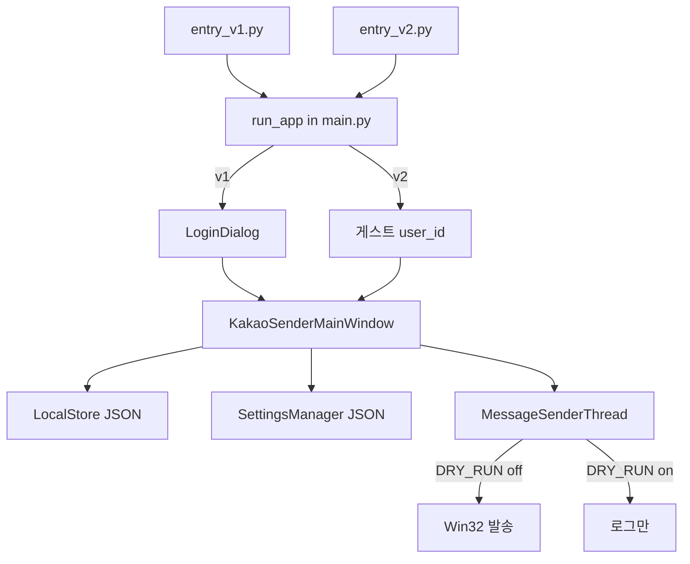

# Repository Map — kakaotalk_autosender

> AI·개발자가 코드베이스를 빠르게 이해하기 위한 지도 문서입니다.  
> 마지막 갱신: 2026-05-19 (Phase 0 반영)

---

## 1. 프로젝트 한 줄 요약

**Windows 전용 PyQt6 데스크톱 앱**으로, 카카오톡 PC 클라이언트 창을 **Win32 API**로 제어해 여러 채팅방에 텍스트·이미지를 자동 발송합니다.

**Phase 0:** V1(로그인) / V2(게스트) 이원화, DRY_RUN, DB secret env 전환 완료.

---

## 2. 버전·진입점 (Phase 0)

| 버전 | 진입 파일 | `KAKAO_SENDER_MODE` | 인증 | 데이터 |
|------|-----------|---------------------|------|--------|
| **V1 일반** | `entry_v1.py` | `v1` | `LoginDialog` → ERP DB | 로컬 JSON + DB(로그인만) |
| **V2 게스트** | `entry_v2.py` | `v2` | 없음 (`user_id` 기본 1) | 로컬 JSON만 |
| 공통 | `main.py` → `run_app()` | env 따름 | — | — |



| 파일 | 역할 |
|------|------|
| `config.py` | 모드, DRY_RUN, 게스트 ID |
| `entry_v1.py` / `entry_v2.py` | PyInstaller 진입점 |
| `main.py` | UI, Win32, `run_app()` |
| `login_dialog.py` | V1 ERP 로그인 |
| `database.py` | V1 DB (`assert_db_configured`, env only) |
| `local_store.py` | templates / logs JSON |
| `settings_manager.py` | settings JSON |

배포: [deployment.md](deployment.md)

---

## 3. 디렉토리 구조

```
kakaotalk_autosender/
├── config.py
├── entry_v1.py / entry_v2.py
├── main.py
├── login_dialog.py
├── database.py
├── local_store.py
├── settings_manager.py
├── style.py                   # main과 중복 가능 — import 여부 확인 필요
├── .env.example               # 커밋용 템플릿
├── requirements.txt
├── build-v1.bat / build-v2.bat / build.bat
├── Pretendard-Regular.ttf
├── docs/ai/                   # repo-map, workflow, deployment
├── docs/specs/                # phase-0, v3 요구사항(질문형)
├── templates_{user_id}.json   # 런타임 (gitignore)
├── logs_{user_id}.json
├── kakao_sender_settings_{user_id}.json
├── build/ / dist/             # gitignore
└── AGENTS.md
```

---

## 4. main.py 핵심

### 4.1 Win32 (DRY_RUN 시 스킵)

| 함수 | 역할 |
|------|------|
| `open_chat` | 카카오톡 검색 → 방 열기 |
| `send_text` | 클립보드 + Enter |
| `send_image` | 이미지 클립보드 + Enter |
| `close_chat` | ESC |
| `list_open_kakao_chats` | 열린 대화창 제목 |

`config.is_dry_run()` 이 True면 Win32 호출 없음 → `check_kakao_running`도 통과.

### 4.2 UI

- 상단: 주의 라벨 + **DRY_RUN 체크박스** (`config.set_dry_run_override`)
- 탭: 일반 발송 / 랜덤 발송 / 템플릿 / 통계
- `MessageSenderThread` → 성공·실패 시 `LocalStore.append_log`

### 4.3 진입

```python
# run_app() 요약
if config.is_v1():
    LoginDialog → user_id, nickname
else:
    config.get_guest_user_id(), get_guest_nickname()
KakaoSenderMainWindow(...)
```

---

## 5. 로컬 JSON 스키마

| 파일 | 용도 |
|------|------|
| `templates_{user_id}.json` | 템플릿 CRUD |
| `logs_{user_id}.json` | 발송 로그 (`is_sent`, `name`, `message` …) |
| `kakao_sender_settings_{user_id}.json` | 탭·방·이미지·예약 설정 |

V2 기본 `user_id=1` → 파일명 `*_1.json`. 다인 PC V2 사용 시 `KAKAO_SENDER_GUEST_USER_ID` 분리 권장.

---

## 6. database.py (V1)

- env: `.{SERVICE_TYPE}.env` + `.env` (프로젝트 루트)
- **하드코딩 secret 제거됨** (Phase 0)
- `assert_db_configured()` — HOST/USER/PASSWORD 없으면 연결 전 오류
- ERP `verify_user` — `login_dialog`에서 사용
- 그 외 네이버·톡톡 등 메서드는 **레거시** (main 미사용)

---

## 7. 실행·빌드

```powershell
pip install -r requirements.txt
python entry_v2.py          # V2
python entry_v1.py          # V1 + .live.env

.\build-v1.bat              # dist\KakaoSender-V1.exe
.\build-v2.bat              # dist\KakaoSender-V2.exe
```

환경변수: `KAKAO_SENDER_MODE`, `KAKAO_SENDER_DRY_RUN`, `KAKAO_SENDER_GUEST_USER_ID`

---

## 8. 테스트·검증

| 항목 | 상태 |
|------|------|
| 자동 테스트 | 없음 |
| DRY_RUN | ✅ UI + env |
| 수동 | DRY_RUN 1방 → logs 확인; 실발송은 테스트 방 1건만 |

---

## 9. 위험 영역

| 영역 | 위험 |
|------|------|
| Win32 발송 | High — 실메시지 |
| 랜덤/예약 타이머 | High |
| `database.py` SQL (재사용 시) | High |
| Git history 내 과거 secret | Critical — 로테이션 별도 |
| `main.py` 대규모 수정 | Medium |

---

## 10. 로드맵 (문서)

| 단계 | 문서 |
|------|------|
| Phase 0 ✅ | [phase-0-dual-build.md](../specs/phase-0-dual-build.md) |
| Phase 2 V3 MVP (기획) | [phase-2-v3-mvp-requirements.md](../specs/phase-2-v3-mvp-requirements.md) |

---

## 11. 확인 필요

- [ ] PyInstaller onefile + `.live.env` 경로 (cwd 이슈)
- [ ] `style.py` 사용 여부
- [ ] DB secret git history 정리·키 로테이션
- [ ] V3 MVP 요구사항 질문지 답변
