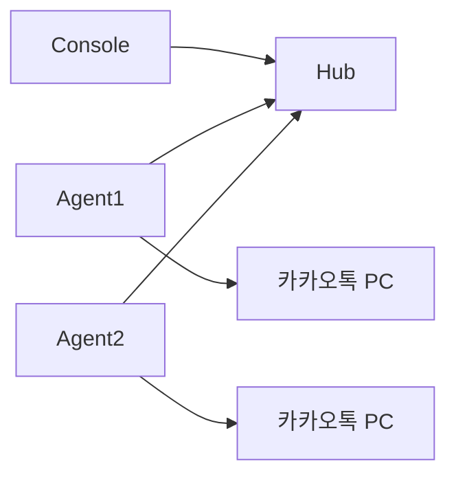

# Phase 2 — V3 멀티 PC 카카오 작업대 MVP 요구사항 (검토용)

**문서 목적:** V3(멀티 PC 카카오 작업대) MVP 범위·기술·운영 방향을 **질문 형태**로 정리합니다.  
**사용 방법:** 각 「답변:」란에 선택지 번호/문자 또는 직접 입력해 주세요. 수정·삭제 의견은 「메모:」에 적어 주세요.

**UI/UX 디자이너 전달용:** 배경·와이어 가이드·디자인 시스템·시나리오는 별도 문서  
→ **[phase-2-v3-uiux-brief.md](phase-2-v3-uiux-brief.md)** (먼저 읽을 것을 권장)

**수정 방향:** 기존 “관제 대시보드”가 아니라, 운영자가 5~10대 PC의 카카오톡을 한 화면에서 골라 **톡방 보기 / 발송하기 / 현재 화면**을 처리하는 **작업대형 UI**를 기준으로 합니다. 사용자 UI에는 `DRY_RUN`, heartbeat, Agent state 같은 개발자 용어를 노출하지 않습니다.

**구현 계획:** [phase-2-v3-workspace-plan.md](phase-2-v3-workspace-plan.md)

**상태:** 초안 — 사용자 검토 대기  
**선행 조건:** Phase 0 (V1/V2, DRY_RUN) 완료  
**관련:** [3버전 로드맵 논의](../../AGENTS.md), [repo-map](../ai/repo-map.md)

---

## 0. 문서 메타

### Q0.1 이 MVP의 가칭 제품명은?

**기본 제안:** 「카카오 매니저」 또는 「V3 멀티 PC 카카오 작업대」 / 영문 코드명 `KakaoWorkspace`

**답변:**

**메모:**

---

### Q0.2 MVP 목표 일정(대략)은?

**기본 제안:** 개발 4~6주 + 내부 파일럿 2주 (인력 1명 기준)

**답변:**  
- [ ] 1개월 이내  
- [ ] 2~3개월  
- [ ] 일정 미정 (품질 우선)  
- [ ] 기타: ___

**메모:**

---

### Q0.3 동시에 운영할 PC(Agent) 대수는?

**기본 제안:** MVP 파일럿 5~10대, 설계 상한 20대

**답변:**  
- 최소 ___ 대  
- MVP 목표 ___ 대  
- 장기 상한 ___ 대  

**메모:**

---

## 1. 비전·목표

### Q1.1 V3로 반드시 달성해야 하는 한 가지는?

**기본 제안:** 「여러 PC의 카카오톡을 한 화면에서 선택하고, 새 톡·미등록 톡방을 확인한 뒤 바로 처리할 수 있다」

**답변:** (자유 기술)

**메모:**

---

### Q1.2 MVP에서 **하지 않아도 되는 것**은? (복수 선택)

**기본 제안:** 완전 원격 제어·차트형 대시보드·개발자용 상태 노출·모바일 앱

**답변:**  
- [ ] 원격으로 실제 메시지 발송 시작  
- [ ] 관제 Web (브라우저) — 데스크톱 Console만  
- [ ] ERP 템플릿 DB 동기화  
- [ ] 발송 예약·랜덤 발송 원격 설정  
- [ ] 영상/파일 발송  
- [ ] Agent 버전/heartbeat/IP 등 상세 상태 화면 노출
- [ ] 차트·통계 대시보드
- [ ] 기타: ___

**메모:**

---

### Q1.3 성공 지표(KPI)는?

**기본 제안:**

| KPI | 목표 |
|-----|------|
| Agent heartbeat 지연 | 90%가 60초 이내 반영 |
| 관제 화면에서 PC 온라인 판별 | 30초 이내 |
| 원격 STOP 반영 | 10초 이내 (Phase 3) |

**답변:** (수정·추가)

**메모:**

---

## 2. 사용자·시나리오

### Q2.0 수정 기획안 기준 핵심 작업 흐름은 맞나요?

**기본 제안:** 왼쪽 PC 선택 → 중앙에서 톡방 보기 → 새 톡/미등록 톡방 확인 → 필요 시 등록 → 하단에서 메시지 보내기 → 문제 시 현재 화면 확인

**답변:**  
- [ ] 이 흐름으로 확정  
- [ ] “보내기”는 MVP에서 제외하고 보기/등록/현재 화면만 먼저  
- [ ] “현재 화면”을 가장 중요한 탭으로 올림  
- [ ] 기타: ___

**메모:**

---

### Q2.0-1 사용자 UI에서 제외할 개발자 용어에 동의하나요?

**기본 제안:** `DRY_RUN`, heartbeat, Agent state, sender_state, polling, WebSocket, payload, remote command는 일반 사용자 화면에 노출하지 않음. 필요하면 설정/고급/개발자 로그로 숨김.

**답변:**  
- [ ] 동의  
- [ ] 관리자 설정 화면에는 일부 표시  
- [ ] 운영자가 볼 수 있어야 하는 항목: ___

**메모:**

---

### Q2.0-2 기본 탭 구성은?

**기본 제안:** `톡방 보기` / `발송하기` / `현재 화면`

**답변:**  
- [ ] 이 3개 탭으로 확정  
- [ ] `톡방 보기`와 `발송하기`를 한 화면에 합침  
- [ ] `현재 화면`을 오른쪽 미리보기 패널로 고정  
- [ ] 기타: ___

**메모:**

---

### Q2.0-3 현재 화면 자동 갱신 정책은?

**기본 제안:** 현재 선택한 PC는 1초 단위로 캡처 갱신하고, 메시지를 보낸 뒤에는 1초 후 자동 캡처하여 이전/이후 대화 흐름을 확인한다. 모든 PC를 동시에 1초마다 캡처하지는 않는다.

**답변:**  
- [x] 선택 PC만 1초 자동 갱신  
- [x] 선택 PC + 발송 중 PC만 1초 자동 갱신  
- [ ] 모든 온라인 PC를 1초 갱신 (부하/개인정보 리스크 큼)  
- [ ] 수동 새로고침만  
- [ ] 기타: ___

**메모:** 확정 정책 — 선택 PC는 1초 자동 캡처, 보내기 직후 1초 뒤 자동 캡처, 해당 PC를 보고 있는 동안 1초 갱신 유지, 다른 PC 선택 시 이전 PC 캡처 중지, 미선택 PC는 상태 정보만 유지.

---

### Q2.0-4 캡처 이미지 저장 정책은?

**기본 제안:** Hub/Console에는 최신 프레임만 유지하고, 일반 캡처 이미지는 영구 저장하지 않는다. 오류/감사 목적일 때만 사용자가 명시적으로 저장한다.

**답변:**  
- [ ] 최신 프레임만 유지  
- [ ] 최근 ___분만 임시 저장  
- [ ] 발송 전/후 캡처만 저장  
- [ ] 모든 캡처 저장 (개인정보 리스크 큼)  
- [ ] 기타: ___

**메모:**

---

### Q2.0-5 AI 자동 응답 프롬프트 구성은?

**기본 제안:** 운영자가 직접 역할, 답변 방식, 예시 응답, 참고 자료, 금지/주의사항을 입력한다. MVP에서는 AI가 바로 보내지 않고 답변 후보만 생성하며, 사람이 확인 후 보낸다.

**답변:**  
- [x] 역할 입력 필수  
- [x] 답변 방식/말투 입력 필수  
- [x] 예시 응답 입력 가능  
- [x] 참고 자료 입력 가능  
- [x] 금지/주의사항 입력 가능  
- [x] AI 답변은 후보만 생성, 사람 확인 후 보내기  
- [ ] 특정 조건에서는 자동 발송 허용  
- [ ] 기타: ___

**메모:** AI 모드는 `off / semi / on` 3단계. `semi`는 명확한 질문은 `[AUTO]`, 애매하면 `[REVIEW]`로 사람 확인을 요구한다.

---

### Q2.0-6 AI가 참고할 자료 범위는?

**기본 제안:** 초반에는 운영자가 직접 붙여넣은 자료와 선택한 대화 문맥만 사용한다. DB/Notion/파일 검색 연동은 후순위.

**답변:**  
- [x] 직접 붙여넣은 참고 자료만  
- [x] 선택한 톡방의 최근 캡처/문맥 포함  
- [ ] 저장된 FAQ/템플릿 포함  
- [ ] Notion/문서 연동  
- [ ] DB/CRM 연동  
- [ ] 기타: ___

**메모:** 채팅 내용은 텍스트로 불러올 수 있으면 텍스트 우선, 안 되면 캡처 이미지 기반 Vision 입력 사용.

---

### Q2.1 주요 사용자 역할은?

**답변:** (해당 역할에 ✓)

| 역할 | 설명 | 필요? |
|------|------|-------|
| **관제자** | 여러 PC 상태 조회·명령 | 답변: |
| **현장 운영자** | 각 PC에서 카카오·Agent 실행 | 답변: |
| **시스템 관리자** | Agent 등록·토큰 발급 | 답변: |
| **개발/IT** | Hub 배포·모니터링 | 답변: |

**메모:**

---

### Q2.2 대표 시나리오 1 — 아침 점검

> 관제자가 출근 후 모든 지점 PC가 카카오톡·Agent 온라인인지 확인한다.

**이 시나리오의 MVP 필수 여부:**  
- [ ] 필수  
- [ ] 있으면 좋음  
- [ ] 불필요  

**화면에 꼭 보여야 할 정보 (복수):**  
- [ ] PC 이름 / 지점명  
- [ ] 온라인/오프라인  
- [ ] 카카오톡 실행 여부  
- [ ] 마지막 발송 시각  
- [ ] 마지막 발송 채팅방명  
- [ ] 마지막 메시지 미리보기  
- [ ] 현재 랜덤 발송 중 여부  
- [ ] 기타: ___

**답변:**

**메모:**

---

### Q2.3 대표 시나리오 2 — 긴급 중지

> 한 PC에서 랜덤 발송이 잘못 돌아가고 있어 관제자가 원격으로 중지한다.

**MVP 포함 여부:**  
- [ ] Phase 2(MVP)에 포함  
- [ ] Phase 3(원격 제어)로 미룸  
- [ ] 불필요  

**답변:**

**메모:**

---

### Q2.4 대표 시나리오 3 — 원격 발송 시작

> 관제 화면에서 PC A를 선택해 «테스트 방»에 메시지를 보낸다.

**MVP 포함 여부:**  
- [ ] 포함 (실발송)  
- [ ] 포함하되 **DRY_RUN만**  
- [ ] Phase 3 이후  
- [ ] 영구 제외 (현장만 발송)

**답변:**

**메모:**

---

## 3. 아키텍처

### Q3.1 전체 구조 선호는?

**기본 제안:** Hub(중앙 서버) + Agent(각 PC) + Console(관제 UI)



**답변:**  
- [ ] A. 위 Hub 중심 (권장)  
- [ ] B. P2P (PC끼리 직접, Hub 없음)  
- [ ] C. 기존 ERP MySQL만 메시지 버스로 사용  
- [ ] D. 기타: ___

**메모:**

---

### Q3.2 Hub 배포 위치는?

**답변:**  
- [ ] 사내 Windows 서버  
- [ ] 클라우드 VPS (Vultr 등 기존 인프라)  
- [ ] Docker (Kubernetes 등)  
- [ ] 개발자 PC localhost (파일럿만)  
- [ ] 미정  

**메모:**

---

### Q3.3 Hub 기술 스택 선호는?

**기본 제안:** Python **FastAPI** + **WebSocket** + **MySQL/PostgreSQL** (ERP DB와 **스키마 분리**)

**답변:**  
- [ ] FastAPI  
- [ ] Flask  
- [ ] Node.js  
- [ ] Django  
- [ ] 기존 ERP DB에 테이블만 추가  
- [ ] 무관 (개발 편의 우선)  

**메모:**

---

### Q3.4 Agent는 V2 exe와 관계는?

**답변:**  
- [ ] A. V2와 **별도 exe** (`KakaoSender-Agent-V3.exe`)  
- [ ] B. V2 exe에 «Agent 모드» 토글 추가 (단일 바이너리)  
- [ ] C. V2 + 백그라운드 서비스 2프로세스  
- [ ] D. 기타: ___

**메모:**

---

### Q3.5 Console(관제 UI) 형태는?

**기본 제안:** MVP는 **PyQt6 데스크톱** (기존 스택 통일), Phase 4에서 Web

**답변:**  
- [ ] A. PyQt6 데스크톱 (카카오톡 UI 느낌 다크 테마)  
- [ ] B. Web (React/Vue 등) — MVP부터  
- [ ] C. 둘 다 (Web 우선)  
- [ ] D. Notion/슬랙 연동만  

**메모:**

---

## 4. Agent (각 PC)

### Q4.1 Agent가 반드시 해야 하는 일 (MVP)

**기본 제안 체크리스트:**

| 기능 | MVP? |
|------|------|
| Hub에 주기 heartbeat | 답변: |
| 카카오톡 실행 여부 보고 | 답변: |
| 마지막 발송 결과 보고 | 답변: |
| 열린 채팅방 목록 보고 | 답변: |
| Win32 실발송 실행 | 답변: |
| V2 UI 전체 제공 | 답변: |
| Windows 트레이 상주 | 답변: |
| 부팅 시 자동 시작 | 답변: |

**메모:**

---

### Q4.2 Heartbeat 주기는?

**답변:**  
- [ ] 10초  
- [ ] 30초 (기본 제안)  
- [ ] 60초  
- [ ] 발송 중만 10초 / 유휴 60초  
- [ ] 기타: ___초  

**메모:**

---

### Q4.3 PC 표시 이름은 어떻게 정하나?

**답변:**  
- [ ] A. Windows hostname 자동  
- [ ] B. 설치 시 관리자가 입력 (예: 강남점-PC1)  
- [ ] C. Hub 웹에서 나중에 수정  
- [ ] D. ERP 지점 마스터와 연동  

**기본값으로 쓸 이름 규칙:** ___

**메모:**

---

### Q4.4 Agent ↔ 기존 V2 발송기 관계

**답변:**  
- [ ] Agent가 V2 UI를 **내장** (한 프로세스)  
- [ ] Agent는 **백그라운드만**, 발송 설정은 여전히 V2 UI  
- [ ] Agent가 V2를 **대체** (현장은 Console만 씀 — 비권장)  

**메모:**

---

### Q4.5 카카오톡 미실행 시 Agent 동작

**답변:**  
- [ ] Hub에 `kakao_running=false`만 보고  
- [ ] 로컬 팝업으로 카카오 실행 요청  
- [ ] 자동으로 카카오톡 exe 실행 시도  
- [ ] 발송 명령 거부 + 관제에 알림  

**메모:**

---

## 5. Hub (중앙 서버)

### Q5.1 MVP API 범위

**기본 제안 (상태 조회만):**

| API | 설명 | MVP? |
|-----|------|------|
| `POST /agents/register` | Agent 등록·토큰 발급 | 답변: |
| `POST /agents/heartbeat` | 상태 수신 | 답변: |
| `GET /agents` | 목록 (관제) | 답변: |
| `GET /agents/{id}` | 상세 | 답변: |
| `POST /commands` | 원격 명령 enqueue | 답변: |
| `GET /commands/{id}` | 명령 결과 | 답변: |
| WebSocket `/ws/console` | 실시간 push | 답변: |

**메모:**

---

### Q5.2 상태 저장 방식

**답변:**  
- [ ] A. DB에 최신 1건만 (`agent_status` 테이블)  
- [ ] B. 시계열 전부 저장 (히스토리)  
- [ ] C. Redis TTL + DB 일배치  
- [ ] D. MVP는 메모리만 (재시작 시 유실 허용)  

**히스토리 보존 기간:** ___일

**메모:**

---

### Q5.3 Hub와 기존 ERP MySQL 관계

**답변:**  
- [ ] **완전 분리** — `kakao_control` 전용 DB (권장)  
- [ ] ERP DB에 스키마만 추가  
- [ ] 로그인만 ERP, 상태는 로컬 JSON  
- [ ] 미정  

**메모:**

---

## 6. Console (관제 UI)

### Q6.1 레이아웃 (카카오톡 유사) 선호

**기본 제안:**

```
┌─────────────┬──────────────────────────┐
│ PC 목록     │  선택 PC 상세             │
│ (채팅목록)  │  - 상태 / 마지막 발송     │
│             │  - 열린 채팅방 목록       │
│             │  - (Phase3) 명령 버튼     │
└─────────────┴──────────────────────────┘
```

**답변:**  
- [ ] 위 2단 레이아웃 동의  
- [ ] 3단 (목록 / 상세 / 로그)  
- [ ] 테이블(엑셀형) 선호  
- [ ] 스케치 첨부 예정  

**메모:**

---

### Q6.2 PC 목록에 표시할 컬럼 (우선순위 1~5)

| 컬럼 | 순위(1=가장 중요) |
|------|------------------|
| PC 이름 | 답변: |
| 온라인 상태 | 답변: |
| 카카오 실행 | 답변: |
| 발송 중/유휴 | 답변: |
| 마지막 발송 시각 | 답변: |
| 마지막 방 이름 | 답변: |
| App 버전 | 답변: |

**메모:**

---

### Q6.3 «마지막 발송 메시지» 표시 수준

**답변:**  
- [ ] A. 전체 본문  
- [ ] B. 앞 50자만 (기본 제안)  
- [ ] C. «메시지 있음» 여부만  
- [ ] D. 해시만 (본문 Hub 미저장)  

**메모:**

---

### Q6.4 Console 로그인

**답변:**  
- [ ] V1과 동일 ERP `verify_user`  
- [ ] Hub 전용 계정 (관제자 테이블)  
- [ ] Agent 토큰만 (단일 사용자)  
- [ ] MVP는 로그인 없음 (사내망만)  

**메모:**

---

### Q6.5 갱신 방식

**답변:**  
- [ ] WebSocket 실시간  
- [ ] 5초 polling  
- [ ] 수동 새로고침만  

**메모:**

---

## 7. 데이터·개인정보

### Q7.1 Hub에 저장해도 되는 데이터는?

**답변:** (허용 ✓)

| 데이터 | 허용? |
|--------|-------|
| PC 이름 / IP | 답변: |
| 채팅방 이름 | 답변: |
| 메시지 본문 | 답변: |
| 수신자 전화번호 | 답변: |
| ERP user_id | 답변: |
| Windows 계정명 | 답변: |

**메모:**

---

### Q7.2 로그 보존·삭제 정책

**답변:**  
- 보존 ___일  
- [ ] 자동 삭제  
- [ ] 수동 export 후 삭제  
- [ ] GDPR/내부 규정: ___

**메모:**

---

### Q7.3 Agent 로컬 `logs_*.json`과 Hub 관계

**답변:**  
- [ ] Hub가 원본, 로컬은 캐시  
- [ ] 로컬 원본, Hub는 요약만  
- [ ] 이중 저장 (동기화)  
- [ ] Hub 미사용, 로컬만  

**메모:**

---

## 8. 보안·인증

### Q8.1 Agent 인증 방식

**기본 제안:** 등록 시 `agent_token` (UUID) → Header `Authorization: Bearer <token>`

**답변:**  
- [ ] 동의  
- [ ] mTLS  
- [ ] IP 화이트리스트만  
- [ ] 기타: ___

**메모:**

---

### Q8.2 Console ↔ Hub 통신

**답변:**  
- [ ] HTTPS 필수  
- [ ] 사내망 HTTP 허용 (MVP)  
- [ ] VPN 뒤에서만 접근  

**메모:**

---

### Q8.3 원격 명령 권한 (Phase 3 대비)

**답변:**  
- [ ] 관제자 전원 동일 권한  
- [ ] PC 그룹별 (지점별)  
- [ ] 실발송 명령은 승인자 2인 이상  
- [ ] MVP는 명령 없음  

**메모:**

---

### Q8.4 감사 로그

**답변:**  
- [ ] 누가·언제·어떤 PC에·어떤 명령 — 필수  
- [ ] MVP 제외  
- [ ] 보존 ___일  

**메모:**

---

## 9. 네트워크·운영

### Q9.1 PC 방화벽 / 아웃바운드

**답변:** Hub URL 예: `https://control.example.com:443`  
- 모든 Agent PC에서 위 주소 **아웃바운드 허용** 가능한가?  
  - [ ] 예  
  - [ ] 일부 PC만  
  - [ ] 프록시 필요: ___

**메모:**

---

### Q9.2 오프라인 Agent 처리

**답변:**  
- [ ] ___분 미heartbeat 시 오프라인  
- [ ] [ ] 알림 (이메일/슬랙/카톡 — 실제 발송 주의)  
- [ ] UI만 표시  

**메모:**

---

### Q9.3 버전 호환

**답변:**  
- [ ] Hub·Agent·Console **동시 배포**만 허용  
- [ ] Agent N-1 호환 1버전  
- [ ] 미정  

**메모:**

---

## 10. V1 / V2와의 관계

### Q10.1 V3 출시 후 V1·V2는?

**답변:**  
- [ ] V2는 현장 단독, V3 Agent는 별도 — **병행**  
- [ ] V2 점진 폐기, Agent로 통합  
- [ ] V1만 유지 + V3 Console  

**메모:**

---

### Q10.2 템플릿·설정 공유

**답변:**  
- [ ] Hub에서 템플릿 중앙 관리 → Agent pull  
- [ ] PC마다 로컬 JSON 유지  
- [ ] MVP는 공유 없음  

**메모:**

---

## 11. 비기능 요구사항

### Q11.1 가용성

**답변:** Hub 가동 목표 ___% / 다운타임 허용 ___

**메모:**

---

### Q11.2 성능

**답변:** Agent ___대일 때 Console 목록 로딩 ___초 이내

**메모:**

---

### Q11.3 장애 시 동작

**답변:**  
- [ ] Hub 다운 시 Agent는 **로컬 V2 발송 계속**  
- [ ] Hub 다운 시 Agent 발송도 중지  
- [ ] 미정  

**메모:**

---

## 12. MVP vs Phase 3 경계 (확정용)

아래 표에 **MVP / Phase3 / 제외** 중 하나를 적어 주세요.

| 기능 | MVP | Phase3 | 제외 |
|------|-------|--------|------|
| PC 목록 + 온라인 상태 | | | |
| 마지막 발송 정보 표시 | | | |
| 카카오 실행 여부 | | | |
| 열린 채팅방 목록 | | | |
| WebSocket 실시간 | | | |
| 원격 랜덤 발송 STOP | | | |
| 원격 일반 발송 START | | | |
| DRY_RUN 원격 명령 | | | |
| 템플릿 Hub 동기화 | | | |
| 알림(오프라인) | | | |
| RBAC | | | |

**메모:**

---

## 13. 리스크 수용

### Q13.1 알고 있는 리스크 중 수용하는 것은?

**답변:** (수용 ✓)

- [ ] 카카오 UI 변경 시 Win32 깨짐  
- [ ] Hub 단일 장애점  
- [ ] 메시지 본문 Hub 저장에 따른 유출 책임  
- [ ] 카카오 이용약관/스팸 정책 (자동화 책임은 사용자)  
- [ ] 기타: ___

**메모:**

---

## 14. 예산·인력 (선택)

### Q14.1 개발 리소스

**답변:**  
- 인원 ___명  
- 외주 [ ] 예 [ ] 아니오  
- Hub 인프라 월 비용 상한 ___원  

**메모:**

---

## 15. 답변 제출 후 다음 단계

답변을 주시면 다음 문서를 작성합니다.

1. **확정 SPEC** — `phase-2-v3-mvp-spec.md` (답변 반영, 구현 가능 수준)  
2. **API 초안** — OpenAPI 스켈레톤  
3. **와이어프레임** — Console 화면 텍스트 목업  
4. **작업 분해** — Hub / Agent / Console 이슈 목록  

---

## 부록 A — 기본 제안 요약 (검토 전 참고)

| 항목 | 기본 제안 |
|------|-----------|
| MVP 범위 | **상태 조회만** (원격 실발송은 Phase 3) |
| 구조 | Hub + Agent + PyQt Console |
| DB | ERP와 분리된 `kakao_control` |
| Agent | V2 Win32 재사용, 별도 exe, 30초 heartbeat |
| 메시지 저장 | Hub에 앞 50자 preview |
| Console 로그인 | ERP 또는 Hub 계정 (Q6.4에서 결정) |
| 파일럿 | PC 2~5대, 6~8주 |

---

## 부록 B — 답변 작성 예시 (1항만)

```text
Q3.1 답변: A (Hub 중심)
Q6.3 답변: B (50자 preview)
Q2.4 답변: Phase 3 이후, MVP는 DRY_RUN 원격만 검토
```

---

**작성:** AI Phase 2 기획 초안  
**검토자:** _______________  
**검토일:** _______________
