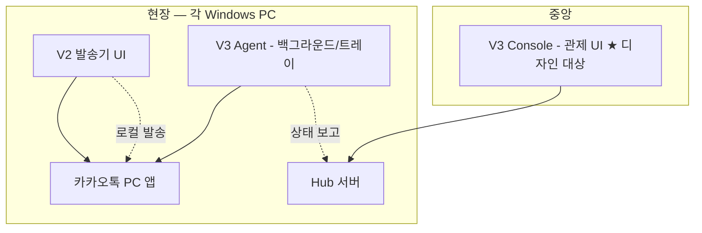

# V3 멀티 PC 카카오 작업대 — UI/UX 디자인 브리프

**대상 독자:** UI/UX 디자이너, Python GUI 개발자, PM  
**작성 목적:** 기존 “관제 대시보드” 기획을, 운영자가 실제로 쓰기 쉬운 **작업형 UI**로 재정의하기 위한 전달 문서  
**기준 플랫폼:** Windows 데스크톱 / PyQt6 또는 PySide6  
**상태:** 수정안 반영 v0.2  
**관련 문서:** [V3 요구사항 질문지](phase-2-v3-mvp-requirements.md)

---

## 1. 방향 수정 요약

기존 기획은 여러 PC의 상태를 한 화면에서 모니터링하는 **관제 대시보드** 성격이 강했습니다.

수정 방향은 **“멀티 PC 카카오 작업대”** 입니다. 운영자는 복잡한 상태 지표를 보는 사람이 아니라, 5~10대 PC의 카카오톡을 한 화면에서 골라 **톡방을 확인하고, 새 톡을 처리하고, 필요한 메시지를 바로 보내는 사람**입니다.

### 핵심 변화

| 기존 | 수정 방향 |
|------|-----------|
| 오른쪽 상태 패널 중심 | 선택 PC 상단에 상태 한 줄 요약 |
| 발송 로그·Agent 상태 중심 | 실제 톡방 작업 중심 |
| `DRY_RUN`, heartbeat 등 개발자 용어 노출 | 일반 사용자 UI에서 제거 |
| 관제용 정보 다수 노출 | 새 톡 / 미등록 톡방 / 현재 화면 중심 |
| “원격 제어”라는 추상 표현 | 톡방 보기 / 발송하기 / 현재 화면 / 보내기 |
| 복잡한 대시보드 | 여러 PC의 카카오톡을 한 화면에 모은 작업대 |

---

## 2. 제품 개념 재정의

### 이전 정의

여러 PC의 카카오 발송 상태를 중앙에서 모니터링하는 관제 Console.

### 수정 정의

**여러 Windows PC에 실행 중인 카카오톡을 한 화면에서 선택하고, 톡방 확인, 새 메시지 확인, 미등록 톡방 등록, 메시지 발송, 현재 화면 확인을 할 수 있는 멀티 PC 카카오 작업대.**

사용자는 다음 흐름으로 느껴야 합니다.

1. 왼쪽에서 PC를 고른다.
2. 가운데에서 해당 PC의 카카오톡 톡방을 확인한다.
3. 새 톡이나 미등록 톡방이 있으면 바로 확인한다.
4. 필요한 경우 톡방을 등록한다.
5. 메시지를 작성하고 보낸다.
6. 문제가 있으면 현재 화면을 확인한다.
7. 발송 중인 작업은 필요 시 중지한다.

목표는 “복잡한 관제”가 아니라 **여러 PC의 카카오톡을 한 곳에서 쉽게 다루는 것**입니다.

---

## 3. 제품 배경

### 현재 문제

- 여러 PC에 카카오톡 PC와 발송기가 각각 실행됩니다.
- 운영자는 PC마다 원격 접속하거나 직접 확인해야 합니다.
- 새 문의가 기존 등록 톡방이 아닌 개인톡 또는 미등록 톡방으로 들어오면 놓치기 쉽습니다.
- 발송 업무에서 중요한 것은 분석 리포트가 아니라 **지금 들어온 톡을 보고 처리하는 속도**입니다.

### V3가 해결할 일

| 문제 | V3 작업대에서의 해결 |
|------|----------------------|
| 여러 PC 상태 확인이 번거로움 | 좌측 PC 목록에 상태와 새 톡 배지 표시 |
| 등록되지 않은 톡방을 놓침 | 미등록 톡방 / 개인톡 영역 제공 |
| 현장 PC 화면을 직접 봐야 함 | 현재 화면 탭에서 카카오톡 화면 미리보기 |
| 발송 과정이 흩어져 있음 | 하단 메시지 입력 / 이미지 첨부 / 예약 / 보내기 통합 |
| 개발자 용어가 어렵다 | 쉬운 한국어 용어만 사용 |

---

## 4. 메인 UI 구조

전체 화면은 크게 3개 영역입니다.

1. **좌측:** PC 목록
2. **중앙:** 선택한 PC의 카카오 작업 화면
3. **하단:** 메시지 입력 및 발송 조작 영역

오른쪽의 별도 상세 상태 패널은 제거하거나 최소화합니다. 상태 정보는 선택한 PC 이름 아래에 한 줄로 요약합니다.

```text
카카오 매니저                                      설정 / 도움말
──────────────────────────────────────────────────────────────
PC 목록          | 강남점-PC1
                | 온라인 · 카카오 실행 중 · 새 톡 3
강남점-PC1  3   |
분당-PC2        | [톡방 보기] [발송하기] [현재 화면]
수원-PC3        |
송파-PC4        | 등록된 톡방
일산-PC5  2     | - 고객상담-A     [열기]
안양-PC6        | - 광고문의방     [열기]
                | - 테스트방       [열기]
                |
                | 미등록 톡방 / 개인톡
                | - 홍길동     개인톡    [열기] [등록]
                | - 김민수     미등록    [열기] [등록]
                |
                | 현재 화면 미리보기
                | 선택한 PC의 카카오톡 화면
                |
                | [메시지를 입력하세요]
                | [이미지 첨부] [예약 발송] [보내기] [발송 중지]
```

---

## 5. 좌측 PC 목록

좌측 PC 목록은 카카오톡의 채팅방 목록처럼 단순하고 빠르게 훑을 수 있어야 합니다. 5~10대 PC를 관리하는 상황을 기준으로 합니다.

### PC Row 필수 정보

- 상태 점
- PC 이름
- 짧은 상태 문구
- 새 톡 개수 배지

### 예시

```text
● 강남점-PC1
  온라인 · 새 톡 3                         [3]

● 분당-PC2
  온라인 · 대기중

● 수원-PC3
  카카오 꺼짐

● 송파-PC4
  오프라인

● 일산-PC5
  온라인 · 새 톡 2                         [2]
```

### 상태 표현

| 상태 | 색상 | 사용자 문구 |
|------|------|-------------|
| 온라인 / 정상 | 초록 | 온라인 · 대기중 |
| 새 톡 있음 | 초록 + 노란 배지 | 온라인 · 새 톡 3 |
| 카카오 꺼짐 | 노랑/주황 | 카카오 꺼짐 |
| 오프라인 | 회색 | 오프라인 |
| 오류 | 빨강 | 오류 · 확인 필요 |

### 표시하지 않을 정보

- Agent 버전
- heartbeat
- IP
- WebSocket / polling
- 프로세스 상태값

운영자가 바로 판단할 수 있는 정보, 특히 **“새 톡 3”처럼 행동을 유도하는 정보**를 우선합니다.

---

## 6. 중앙 화면 — 선택한 PC의 카카오 작업 공간

중앙 화면은 선택한 PC의 작업 공간입니다. 복잡한 상태 카드나 테이블이 아니라, 해당 PC의 카카오톡을 조작하는 느낌이어야 합니다.

상단에는 PC 이름과 상태 한 줄을 표시합니다.

```text
강남점-PC1
온라인 · 카카오 실행 중 · 새 톡 3
```

그 아래에는 3개의 탭을 둡니다.

1. **톡방 보기**
2. **발송하기**
3. **현재 화면**

---

## 7. 탭 1 — 톡방 보기

“톡방 보기”는 가장 중요한 기본 화면입니다. 선택한 PC에서 감지된 **등록 톡방**, **미등록 톡방**, **개인톡**을 한눈에 볼 수 있어야 합니다.

### 7.1 등록된 톡방

- 기존에 발송 대상으로 등록된 톡방
- 새 메시지가 있는 톡방은 상단 표시
- 각 톡방마다 `[열기]` 버튼 제공

```text
등록된 톡방                                      새 톡 3

고객상담-A
김지현: 전화드렸는데 부재중이셔서 톡 남겨요~     오전 10:15   [열기]

광고문의방
박상민: 배너 시안 확인 부탁드립니다.              오전 09:42   [열기]

테스트방
이수빈: 테스트 메시지입니다 :)                    어제 17:33   [열기]
```

### 7.2 미등록 톡방 / 개인톡

- 기존에 등록해두지 않았지만 현재 PC 카카오톡에서 감지된 톡방
- 개인톡도 이 영역에 표시
- 미등록 톡방은 바로 등록할 수 있어야 함

```text
미등록 톡방 / 개인톡

홍길동       개인톡
안녕하세요 문의드립니다...                       오전 11:02   [열기] [등록]

김민수       미등록
견적서 보내주실 수 있나요?                       오전 10:48   [열기] [등록]

이현정       미등록
감사합니다! 확인했어요.                          어제 16:20   [열기] [등록]
```

핵심 UX는 **감지 → 확인 → 등록 → 처리**를 같은 화면에서 끝내는 것입니다.

---

## 8. 탭 2 — 발송하기

“발송하기”는 기존 발송 기능을 단순화한 화면입니다.

### 필수 기능

- 채팅방 선택
- 메시지 입력
- 이미지 첨부
- 예약 발송
- 보내기
- 발송 중지

### 제외할 표현

- DRY_RUN
- 개발자용 상태값
- 복잡한 로그
- Agent 정보
- 상세 디버그 정보

### 예시

```text
채팅방: [고객상담-A ▼]

[ 메시지를 입력하세요                                    ]

[이미지 첨부] [예약 발송]                   [보내기] [발송 중지]
```

### 표현 원칙

- “발송 실행”보다 **“보내기”**
- “STOP”보다 **“발송 중지”**
- “예약”보다 **“예약 발송”**
- “DRY_RUN”은 일반 사용자 화면에서 제거

내부적으로 안전 모드가 필요하면 설정/관리자 기능으로 숨깁니다.

---

## 9. 탭 3 — 현재 화면

“현재 화면”은 선택한 PC의 카카오톡 화면을 확인하는 기능입니다. 등록되지 않은 톡방, 개인톡, 오류 상황을 확인할 때 중요합니다.

### 목적

- 해당 PC에 실제로 어떤 카카오톡 화면이 떠 있는지 확인
- 새 톡이나 미등록 톡방이 실제로 보이는지 확인
- 카카오톡이 꺼졌거나 오류 상태일 때 현황 확인
- 현장 PC에 직접 원격 접속하지 않고 기본 상황 파악
- 보내기 직후 화면을 자동 갱신해 이전 대화와 이후 답변을 자연스럽게 확인

### 기본 UI

```text
현재 화면

[ 선택한 PC의 카카오톡 화면 미리보기 ]
마지막 갱신: 방금 전 · 자동 갱신 중

[자동 갱신: 켜짐] [새로고침] [카카오톡 앞으로 가져오기]
```

### 자동 갱신 UX

기본 경험은 “원격 데스크톱”이 아니라 **선택한 PC의 카카오톡 화면이 1초마다 사진처럼 갱신되는 미리보기**입니다.

권장 동작:

| 상황 | UI 동작 |
|------|---------|
| PC 선택 | 화면 미리보기 즉시 갱신 후 1초 단위 자동 갱신 |
| 톡방 열기 | 열린 화면을 1초 뒤 다시 캡처 |
| 보내기 | 보내기 완료 후 1초 뒤 자동 캡처, 이후 계속 1초 갱신 |
| 발송 중지 | 중지 결과 확인을 위해 1초 뒤 캡처 |
| 다른 PC 선택 | 이전 PC 자동 갱신 중지, 새 PC 자동 갱신 시작 |
| Console 최소화 | 자동 갱신 일시 중지 또는 저속 모드 |

화면 문구:

- “자동 갱신 중”
- “마지막 갱신: 12:16:03”
- “갱신 실패 — 마지막 화면을 표시 중”

주의:

- 모든 PC를 1초마다 동시에 갱신하지 않음.
- 기본은 **현재 선택한 PC 1대**와 **발송 직후 PC** 중심.
- 캡처에는 개인톡/대화 내용이 포함될 수 있으므로 디자이너는 민감정보 마스킹 상태도 설계해야 함.

### 단계별 구현

1. **MVP:** 화면 캡처 보기, 1초 단위 자동 갱신, 보내기 후 자동 캡처, 수동 새로고침
2. **후속:** 카카오톡 앞으로 가져오기, 선택 톡방 열기, 미등록 톡방 등록, 제한된 버튼 조작
3. **장기:** 클릭 기반 원격 조작, 키보드 입력 전달, 완전 원격 제어

완전 원격 조작은 실수와 보안 이슈가 크므로 후순위입니다.

---

## 10. 미등록 톡방 관리

미등록 톡방 관리는 수정 기획안의 핵심 기능입니다.

### 문제 상황

- 운영 중 새 문의가 기존에 등록되지 않은 톡방으로 들어올 수 있음
- 개인톡으로 고객 문의가 올 수 있음
- 기존 구조에서는 해당 PC를 직접 보지 않으면 놓칠 수 있음

### 해결 방향

- Agent가 현재 PC의 카카오톡에서 감지 가능한 톡방 목록을 Console에 전달
- 등록된 톡방과 미등록 톡방을 구분 표시
- 미등록 톡방은 바로 등록 가능
- 새 메시지가 있는 미등록 톡방은 좌측 PC 목록에 새 톡 배지로 표시

### 등록 플로우

1. 미등록 톡방 감지
2. 운영자가 `[열기]`로 내용 확인
3. 필요한 경우 `[등록]` 클릭
4. 표시 이름, 분류, 알림 여부 선택
5. 등록 완료 후 “등록된 톡방” 목록으로 이동

### 등록 팝업 예시

```text
톡방 등록

톡방 이름: 홍길동
표시 이름: 홍길동 개인문의
분류: 고객상담
알림: 켜기

[취소] [등록]
```

---

## 11. 개인톡 알림

개인톡 알림은 유용하지만 개인정보와 운영 정책이 중요합니다.

### 추천 정책

- 개인톡은 기본적으로 **도착 알림 중심**으로 표시
- 내용은 필요 시에만 열람
- 누가 언제 열람했는지 로그를 남기는 것을 권장
- 회사 업무용 카카오 계정 기준으로 운영 정책 명확화

### UI 예시

```text
홍길동 개인톡 도착
[내용 보기] [무시] [알림 끄기]
```

개인정보 노출을 줄이는 방식:

```text
개인톡 1건 도착
보낸 사람: 홍*동
내용: 숨김
[내용 보기]
```

원칙은 **최소 노출 → 필요 시 열람 → 열람 기록 유지**입니다.

---

## 12. 하단 메시지 입력 영역

하단은 실제 작업자가 가장 자주 쓰는 영역입니다.

V3에서는 캡처 이미지 안에 보이는 카카오톡 기본 입력 영역을 그대로 쓰지 않고, **캡처 이미지의 하단 입력 영역은 숨긴 뒤 V3 자체 입력 UI로 대체**하는 방향을 권장합니다. 이렇게 하면 사용자는 “원격 화면을 보는 중”이 아니라, V3 작업대 안에서 바로 대화하는 느낌을 받을 수 있습니다.

```text
[ 메시지를 입력하세요                                      ]

[이미지 첨부] [예약 발송]                  [보내기] [발송 중지]
```

### 버튼 설명

| 버튼 | 설명 |
|------|------|
| 이미지 첨부 | 이미지 파일 선택 |
| 예약 발송 | 예약 시간 설정, 톡방 옆 카운트다운 타이머 표시 |
| 보내기 | 선택된 PC와 선택된 톡방으로 메시지 전송 |
| 발송 중지 | 현재 PC에서 진행 중인 발송 중단 |

### 예약 타이머 UX

예약 발송을 걸면 선택한 톡방 옆에 작은 타이머가 붙습니다.

```text
고객상담-A   ⏱ 04:32
열림 · 예약 2건
```

여러 방에 예약이 걸린 경우 각 방 옆에 가장 가까운 예약 타이머를 표시합니다. 별도 `예약 / AI` 탭에서는 모든 예약을 시간순으로 보여줍니다.

타이머를 클릭하면:

- 어떤 메시지가 갈지
- 몇 시에 발송될지
- 어떤 톡방 대상인지

를 바로 확인할 수 있어야 합니다.

디자인 방향:

- 노란색 원형/캡슐 타이머
- 시간이 1분 이하로 남으면 주황/빨강 강조
- 너무 많은 정보 대신 “남은 시간 + 예약 건수” 중심

### 캡처 이미지와 입력 영역의 관계

```text
[ 캡처된 카카오톡 대화 내용 영역 ]
[ 카카오 기본 입력창 영역은 crop/마스킹 ]
──────────────────────────────
[ V3 자체 메시지 입력창 ]
[이미지 첨부] [예약 발송] [보내기]
```

UI 원칙:

- 캡처는 “이전 대화와 이후 답변 확인” 역할
- 입력/보내기는 V3 자체 UI에서 수행
- 보내기 후 1초 뒤 캡처가 갱신되어 실제로 보낸 느낌을 강화
- 실제 카카오 입력창은 사용자에게 보이지 않거나 흐리게 처리

### 제외

- DRY_RUN
- 디버그 모드
- 테스트 모드
- 내부 상태값

---

## 13. 상태 정보 표시 방식

상태 정보는 많을수록 좋은 것이 아니라, 운영자가 바로 행동할 수 있을 만큼만 보여줍니다.

### 상단 한 줄 예시

```text
온라인 · 카카오 실행 중 · 새 톡 3
온라인 · 대기중
카카오 꺼짐 · 확인 필요
오프라인 · 마지막 연결 32분 전
오류 · 카카오 응답 없음
```

### 우선순위

1. 온라인 여부
2. 카카오 실행 여부
3. 새 톡 개수
4. 발송 중 여부
5. 오류 여부

상세 정보는 필요 시 설정 또는 고급 정보에서만 보여줍니다.

---

## 14. MVP 우선순위

### 1차 MVP 포함

1. **PC 목록**
   - 온라인, 카카오 꺼짐, 오프라인 표시
   - 새 톡 개수 표시
2. **톡방 보기**
   - 등록된 톡방 목록
   - 최근 메시지 미리보기
   - 톡방 열기
3. **미등록 톡방 표시**
   - 개인톡 / 미등록 톡방 구분
   - `[열기]`, `[등록]`
4. **메시지 입력 / 보내기**
   - 텍스트 입력
   - 이미지 첨부
   - 예약 발송
   - 보내기
   - 발송 중지
5. **현재 화면 보기**
   - 선택한 PC의 카카오톡 화면 미리보기
   - 1초 단위 자동 갱신
   - 보내기 후 1초 뒤 자동 캡처
   - 수동 새로고침
6. **개인톡 알림**
   - 도착 알림 중심
   - 내용 열람은 클릭 시
   - 열람 기록 권장
7. **예약 타이머**
   - 톡방 옆 카운트다운
   - 여러 예약 목록
   - 타이머 클릭 시 메시지 미리보기
8. **AI 자동 응답 후보**
   - 역할 설정
   - off / semi / on 모드
   - 답변 적극성 설정
   - 직접 프롬프트 입력
   - 답변 방식 / 예시 응답 / 참고 자료 / 금지사항 입력
   - 실제 자동 발송 전 사람 확인

### AI 자동 응답 설정 UX

AI 자동 응답은 “자동 발송”보다 **답변 후보 생성**으로 먼저 설계합니다. 운영자는 아래 항목을 직접 지정할 수 있어야 합니다.

| 항목 | 설명 |
|------|------|
| 역할 | 예: 친절한 분양 상담원, CS 담당자 |
| 답변 방식 | 문장 길이, 말투, 답변 순서, 상담 유도 방식 |
| 예시 응답 | 원하는 답변 스타일 샘플 |
| 참고 자료 | FAQ, 운영시간, 가격표, 내부 상담 가이드 |
| 금지/주의사항 | 단정 금지, 개인정보 요구 금지, 법률/세무 주의 |
| 답변 적극성 | 1=보수적, 5=적극적 |
| 모드 | off / semi / on |

모드 정의:

- `off`: AI 사용 안 함
- `semi`: 명확한 질문은 AI가 자동 답변 후보를 만들고, 애매하면 사람 확인으로 넘김
- `on`: 모든 질문에 답변 후보를 만들되, 불확실하면 사람 확인 표시

UI 원칙:

- 프롬프트 설정은 운영자가 직접 수정 가능
- AI 후보는 바로 발송하지 않고 미리보기로 표시
- “이 답변 보내기”는 사람이 눌러야 함
- 실제 자동 발송은 별도 권한/정책이 정해진 뒤 후순위
- 대화 내용은 텍스트로 읽을 수 있으면 텍스트 우선, 안 되면 캡처 이미지 기반 Vision 입력

### 후순위

- 제한된 원격 조작
- 카카오톡 앞으로 가져오기
- 클릭 기반 제어
- 키보드 입력 전달
- 전체 메시지 검색
- PC 그룹 관리
- 권한별 메시지 열람 제한
- 상세 로그 / Agent 상태 / heartbeat 표시

---

## 15. 디자인 톤

### 방향

- 다크 테마 기반
- 카카오톡에서 연상되는 노란색을 포인트 컬러로 사용
- 공식 카카오톡 UI를 그대로 복제하지 않음
- 채팅 앱처럼 익숙한 구조
- 내부 운영툴처럼 실용적이고 단순한 구조
- 과한 차트, 통계, 테이블 제거
- 버튼과 상태 문구는 쉬운 한국어 사용

### 권장 색상

| 토큰 | 값 |
|------|----|
| Background | `#121212` |
| Surface | `#1A1A1A` |
| Border | `#2A2A2A` |
| Primary Yellow | `#FEE500` |
| Text Primary | `#FFFFFF` |
| Text Secondary | `#B5B5B5` |
| Success | 초록 계열 |
| Warning | 노랑/주황 계열 |
| Error | 빨강 계열 |
| Offline | 회색 계열 |

---

## 16. 용어 가이드

### 사용자에게 보여줄 용어

- 톡방 보기
- 발송하기
- 현재 화면
- 새 톡
- 미등록 톡방
- 개인톡
- 톡방 등록
- 보내기
- 발송 중지
- 예약 발송
- 이미지 첨부
- 카카오 실행 중
- 카카오 꺼짐

### 사용자 UI에서 피할 용어

- DRY_RUN
- heartbeat
- Agent state
- sender_state
- polling
- WebSocket
- remote command
- debug mode
- payload
- process

---

## 17. 디자이너 산출물 요청

| # | 산출물 | 설명 |
|---|--------|------|
| 1 | User flow | PC 선택 → 톡방 확인 → 등록/발송/현재 화면 |
| 2 | 메인 와이어프레임 | 좌측 PC 목록 / 중앙 탭 / 하단 입력 |
| 3 | 톡방 보기 화면 | 등록 톡방 + 미등록/개인톡 |
| 4 | 발송하기 화면 | 채팅방 선택, 입력, 이미지, 예약, 보내기 |
| 5 | 현재 화면 화면 | 화면 미리보기, 새로고침 |
| 6 | 상태/배지 컴포넌트 | 온라인, 카카오 꺼짐, 오프라인, 새 톡 |
| 7 | 등록 팝업 | 미등록 톡방 등록 |
| 8 | Empty/Error 상태 | PC 없음, 카카오 꺼짐, 오프라인, 캡처 실패 |

---

## 18. 최종 결론

이번 수정 기획안의 핵심은 다음입니다.

**기존:** 여러 PC 상태를 보는 관제 대시보드  
**수정:** 여러 PC의 카카오톡을 하나의 앱에서 쉽게 다루는 멀티 PC 카카오 작업대

운영자는 복잡한 정보를 보는 것이 아니라, PC를 선택하고, 톡방을 확인하고, 새 메시지를 처리하고, 필요하면 바로 메시지를 보내거나 현재 화면을 확인할 수 있어야 합니다.

UI는 다음 원칙으로 설계합니다.

1. 정보량 최소화
2. 채팅 앱처럼 익숙한 구조
3. 새 톡과 미등록 톡방을 놓치지 않는 구조
4. 메시지 입력과 발송을 가장 쉽게 배치
5. 현재 화면 확인 기능 제공
6. 개인톡은 최소 노출과 기록 유지 원칙 적용
7. 개발자 용어 제거
8. PyQt6 / Windows 데스크톱에 맞는 단순하고 안정적인 UI

이 방향으로 설계하면, 5~10대 PC 환경에서도 사용자는 복잡한 관제 도구를 쓰는 느낌이 아니라 **여러 PC의 카카오톡을 한 화면에 모아놓고 처리하는 느낌**으로 사용할 수 있습니다.
# V3 멀티 PC 관제 — UI/UX 디자인 브리프

**대상 독자:** UI/UX 디자이너 (제품·개발 배경 없이 읽어도 이해되도록 작성)  
**작성 목적:** V3 「관제 Console」화면 기획·와이어프레임·디자인 시스템 제안을 받기 위한 배경 지식  
**상태:** 초안 (요구사항 확정 전 — [질문지](phase-2-v3-mvp-requirements.md)와 함께 검토)  
**관련 제품:** 카카오톡 메시지 발송기 V1 / V2 / V3 (Windows 데스크톱)

---

## 1. 한 줄 요약

**여러 대의 Windows PC**에서 각각 돌아가는 **카카오톡 PC + 자동 발송 프로그램**을, **한 명의 관제자**가 **한 화면(Console)**에서 **상태 확인**하고 (추후) **원격 제어**할 수 있게 하는 **내부용 관제 도구**입니다.

> ⚠️ 카카오 공식 API·오픈채널이 아닙니다. PC 화면의 카카오톡 창을 프로그램이 조작하는 방식입니다.

---

## 2. 왜 이 제품이 필요한가 (배경)

### 2.1 현재 상황

- 조직에서 **여러 PC**(지점, 담당자별 PC 등)에 **카카오톡 PC 버전**이 설치되어 있고, **동일한 발송기 프로그램(V2)**으로 채팅방에 메시지·이미지를 **일괄/반복 발송**하고 있습니다.
- 발송 작업은 **각 PC 앞에서** 직접 앱을 열고 설정·실행해야 합니다.
- **중앙에서** “지금 몇 번 PC가 켜져 있는지”, “방금 어떤 채팅방에 무엇을 보냈는지”, “랜덤 발송이 아직 도는지”를 보려면 **PC마다 원격 접속(RDP)하거나 전화로 확인**해야 합니다.

### 2.2 V3가 풀고자 하는 문제

| Pain | V3 방향 |
|------|---------|
| PC마다 상태를 일일이 확인 | **한 화면에 PC 목록 + 상태** |
| 잘못된 발송을 멀리서 못 멈춤 | (Phase 3) **원격 중지·DRY_RUN** |
| 누가 어떤 PC에서 보냈는지 추적 어려움 | **마지막 발송·로그·PC 이름** 통합 표시 |
| 운영 실수(카카오 미실행 등) | **카카오 실행 여부**를 관제 화면에 표시 |

### 2.3 비유 (디자인 방향 잡기용)

- **Slack/Discord 서버 목록**처럼 왼쪽에 “대상(PC)” 목록, 오른쪽에 “선택한 대상의 상세”
- 또는 **카카오톡 PC**처럼 왼쪽 **채팅 목록 → 오른쪽 대화/상세** (익숙한 멘탈 모델)
- 단, 오른쪽은 “대화 입력”이 아니라 **「기기 상태 + 발송 이력 + (추후) 제어 버튼」** 중심

---

## 3. 제품군 구조 (V1 / V2 / V3)

디자이너는 **V3 Console**이 주 대상이지만, **V2 현장 앱**과 시각적·용어적 **일관성**이 있으면 좋습니다.



| 버전 | 사용자 | UI | 역할 |
|------|--------|-----|------|
| **V1 일반** | 로그인한 직원 | 기존 발송기 + 로그인 창 | ERP 계정으로 로그인 후 발송 |
| **V2 게스트** | 현장 운영자 | 기존 발송기 (로그인 없음) | 해당 PC에서 직접 발송·설정 |
| **V3 Agent** | (백그라운드) | 트레이 아이콘 수준 (별도 간소 UI 가능) | 상태 수집·명령 수신·Win32 발송 실행 |
| **V3 Console** | **관제자** | **★ 새로 기획할 화면** | 여러 PC 모니터링·(추후) 원격 명령 |

**MVP(1차) 범위 가정:** Console은 **「보기(모니터링)」** 위주. **원격으로 실제 메시지 보내기**는 Phase 3 또는 DRY_RUN만 — [질문지 Q2.4](phase-2-v3-mvp-requirements.md)에서 확정 예정.

---

## 4. 카카오톡 발송이 어떻게 동작하는지 (UX 제약 이해)

### 4.1 기술 방식 (UI에 영향)

- **공식 카카오 API가 아님.** Windows에서 **카카오톡 PC 프로그램 창**을 자동화합니다.
- 따라서:
  - **카카오톡이 그 PC에서 실행 중**이어야 발송 가능
  - **채팅방 이름**은 카카오에 보이는 제목과 **정확히 일치**해야 함
  - 카카오 UI가 업데이트되면 발송이 깨질 수 있음 → 관제 화면에 **「발송 실패」** 상태가 자주 의미 있음

### 4.2 현장 앱(V2)에서 사용자가 하는 일

1. 채팅방 목록 등록 (직접 입력 / 엑셀 / “지금 열린 채팅방 추가”)
2. 메시지·이미지 작성 (또는 템플릿 불러오기)
3. **일반 발송** (한 번에 전송) / **랜덤 발송** (간격 두고 반복) / **예약 발송**
4. **통계** 탭에서 과거 발송 로그 확인

### 4.3 DRY_RUN (테스트 모드)

- 체크 시 **실제 카카오에는 안 보내고** 로그만 남김
- 관제·개발·교육 시 안전장치 — UI에 **눈에 띄는 토글** 필요 (V2에 이미 있음, V3 원격 명령에도 동일 개념 권장)

---

## 5. 기존 앱(V2) UI 레퍼런스 — 디자인 시스템

V3 Console은 **새 레이아웃**이지만, **브랜드 톤 통일**을 권장합니다 (이미 구현된 스타일).

### 5.1 플랫폼·폰트

| 항목 | 값 |
|------|-----|
| 플랫폼 | **Windows 데스크톱** (PyQt6 구현 예정 — Figma는 자유, 개발 시 컴포넌트 매핑) |
| 주 폰트 | **Pretendard** (없으면 Segoe UI, Apple SD Gothic Neo) |
| 기본 글자 크기 | 16px 전후 |

### 5.2 컬러 (카카오톡 PC 앱에서 영감 — 완전 복제 아님)

| 토큰 | HEX | 용도 |
|------|-----|------|
| Primary (카카오 옐로우) | `#FEE500` | 주요 버튼, 선택 탭, 강조 |
| Primary hover | `#F4D300` | 버튼 hover |
| Background | `#121212` | 앱 배경 |
| Surface | `#1A1A1A` | 입력·카드·리스트 배경 |
| Border | `#2A2A2A` | 구분선 |
| Text | `#FFFFFF` | 본문 |
| Text on primary | `#191919` | 옐로우 위 텍스트 |
| Warning | `#FF6B6B` | 상단 주의 배너 (V2에 사용 중) |
| Disabled button | `#4a4a4a` | 비활성 |

### 5.3 컴포넌트 성격 (V2)

- **탭:** 일반 발송 / 랜덤 발송 / 메시지 템플릿 / 통계
- **버튼:** 둥근 모서리(8px), 굵은 라벨
- **리스트:** 채팅방 목록, 다크 surface + 선택 시 옐로우 하이라이트
- **상단 경고 배너:** 빨간 배경 — “카카오톡 실행 필요” 등

### 5.4 V2 화면 구조 (텍스트 와이어)

```
┌─────────────────────────────────────────────────────────────┐
│ ⚠ 카카오톡이 실행 중일 때만 발송 가능 (빨간 배너)              │
│ ☐ DRY_RUN — 실제 발송 없이 로그만                            │
├─────────────────────────────────────────────────────────────┤
│ [ 일반 발송 ] [ 랜덤 발송 ] [ 메시지 템플릿 ] [ 통계 ]         │
├──────────────────┬──────────────────────────────────────────┤
│ 채팅방 목록       │ 메시지 / 이미지 / 예약 / 발송 버튼         │
│ (리스트)         │ (탭마다 레이아웃 다름)                    │
│                  │                                          │
│ 엑셀 불러오기 등  │ 로그 텍스트 영역                          │
└──────────────────┴──────────────────────────────────────────┘
```

**디자이너 전달용:** V2 실제 스크린샷이 있으면 PM이 별도 첨부 권장. 없으면 위 토큰·구조로 **동일 계열** Console 제안.

---

## 6. V3 Console — 디자인 대상 정의

### 6.1 제품 정의

**「멀티 PC 카카오 발송 관제 센터」** — 관제자 1명이 N대 PC의 **건강 상태**와 **최근 발송 활동**을 카카오톡 채팅 목록을 보듯 **스캔**할 수 있는 데스크톱 앱 (MVP).  
추후: 선택 PC에 **중지·DRY_RUN·(승인 후) 발송** 명령.

### 6.2 주 사용자 (Persona)

#### Persona A — 관제자 (Primary)

- **누구:** 본사/팀 리드, 마케팅·CS 운영 담당
- **목표:** 아침에 모든 지점 PC가 정상인지 30초 안에 파악
- **불편:** RDP 여러 번, 전화 확인, “혹시 아직 랜덤 발송 도나?” 불안
- **디바이스:** Windows PC, 큰 모니터 또는 노트북 (1280px 이상 가정)

#### Persona B — 현장 운영자 (Secondary, V2/Agent)

- **누구:** 지점 직원
- **목표:** 자기 PC에서 카카오 켜 두고 발송기 실행
- **V3와 관계:** Agent가 백그라운드에서 상태만 올림; **복잡한 설정은 V2에서 계속**할 가능성 큼
- **디자인:** Agent 트레이 메뉴는 MVP에서 **최소**(연결 상태, PC 이름)만 있어도 됨

#### Persona C — IT/관리자 (Tertiary)

- Agent 등록, 토큰, Hub URL — **설정 화면**은 MVP 이후 가능. Figma에 **설정 진입점**만预留.

### 6.3 핵심 사용자 여정 (UX 시나리오)

#### Journey 1 — 아침 점검 (MVP 핵심)

| 단계 | 사용자 행동 | 시스템/화면 |
|------|-------------|-------------|
| 1 | Console 실행·로그인 | 로그인 (방식 미정) |
| 2 | PC 목록 훑어봄 | 🟢🟡🔴 상태 한눈에 |
| 3 | 🔴 PC 클릭 | 상세: 오프라인 사유, 마지막 seen |
| 4 | 🟡 “카카오 미실행” 클릭 | 상세 + 현장에 연락 |
| 5 | 문제 없으면 종료 | — |

**성공:** 전원 🟢, 카카오 실행, 최근 발송 시각 정상.

#### Journey 2 — 발송 중 모니터링

| 단계 | 행동 | 화면 |
|------|------|------|
| 1 | 목록에서 “발송 중” 뱃지 확인 | `sender_state: sending_random` 등 |
| 2 | PC 선택 | 마지막 방·메시지 preview, 다음 발송까지(있으면) |
| 3 | 이상 시 현장 연락 또는 (P3) 원격 STOP | 확인 다이얼로그 |

#### Journey 3 — 긴급 중지 (Phase 3, UI 미리 고려)

| 단계 | 행동 | 화면 |
|------|------|------|
| 1 | 문제 PC 선택 | 상세 패널 |
| 2 | 「랜덤 발송 중지」 클릭 | **이중 확인** 모달 |
| 3 | 결과 대기 | “명령 전송됨 → 완료/실패” 토스트 |

#### Journey 4 — (선택) 원격 테스트 발송 DRY_RUN

| 단계 | 행동 | 화면 |
|------|------|------|
| 1 | PC 선택 → 「테스트 발송」 | DRY_RUN 강조, 방·메시지 입력 |
| 2 | 실행 | 로그만 반영, 카카오 미발송 |

---

## 7. 정보 구조 (IA)

```
Console (V3)
├── 로그인 (V1 연동 or Hub 계정 — 미정)
├── 대시보드 / 관제 메인 ★ MVP
│   ├── [글로벌] 연결 상태(Hub), 마지막 전체 sync 시각, 검색/필터
│   ├── [좌] PC 목록
│   └── [우] PC 상세
│       ├── 상태 카드 (온라인, 카카오, 발송 상태)
│       ├── 마지막 발송
│       ├── 열린 카카오 채팅방 목록 (read-only)
│       └── (P3) 명령 영역
├── (P2+) 알림 / 이벤트 로그
├── (P2+) PC 그룹 (지점별)
└── 설정 (Hub URL, 테마 — 후순위)
```

---

## 8. 화면별 상세 — 와이어프레임 가이드 (텍스트)

### 8.1 로그인 (확정 전 — 레퍼런스만)

V1 로그인과 유사한 **소형 다이얼로그** (300×200 전후): 아이디, 비밀번호, 로그인 버튼.  
Console 전용 계정이면 **동일 톤** 유지.

---

### 8.2 관제 메인 — 2단 레이아웃 (MVP 제안)

**권장 브레이크포인트:** 최소 너비 **1100px**, 좌측 목록 **280~320px** 고정.

```
┌──────────────────────────────────────────────────────────────────────────┐
│  카카오톡 발송 관제  [Hub ●연결됨]              마지막 갱신 14:32:05  [↻] │
│  [ 🔍 PC 검색... ]  [ 필터 ▼ 전체 | 온라인만 | 문제만 ]                    │
├────────────────────┬─────────────────────────────────────────────────────┤
│  PC 5대 · 🟢4 🟡0 🔴1│  강남점-PC1                    🟢 온라인            │
│                    │  ─────────────────────────────────────────────────   │
│ ┌────────────────┐ │  ┌─ 상태 ─────────────────────────────────────┐  │
│ │🟢 강남점-PC1    │ │  │ 카카오톡  ● 실행 중                          │  │
│ │   2분 전 · 발송중│ │  │ 발송      ● 랜덤 발송 중 (다음 03:42)         │  │
│ ├────────────────┤ │  │ Agent     v3.0.0 · heartbeat 15초 전         │  │
│ │🟢 분당-PC2      │ │  └────────────────────────────────────────────┘  │
│ │   5분 전 · 유휴  │ │  ┌─ 마지막 발송 ───────────────────────────────┐  │
│ ├────────────────┤ │  │ 방: 고객상담-A                               │  │
│ │🔴 수원-PC3      │ │  │ 시각: 14:28 · 성공                           │  │
│ │   32분 전 오프라인│ │  │ 메시지: 안녕하세요, 문의 주셔서 감사… (50자)   │  │
│ └────────────────┘ │  └────────────────────────────────────────────┘  │
│                    │  ┌─ 열린 카카오 채팅방 (5) ──────────────────────┐  │
│                    │  │ · 고객상담-A  · 테스트방  · …                  │  │
│                    │  └────────────────────────────────────────────┘  │
│                    │  ┌─ (Phase 3) 제어 ─────────────────────────────┐  │
│                    │  │ [ 랜덤 발송 중지 ]  [ DRY_RUN 테스트 ] (비활성) │  │
│                    │  └────────────────────────────────────────────┘  │
└────────────────────┴─────────────────────────────────────────────────────┘
```

#### 좌측 — PC 목록 (채팅 목록 메타포)

각 **행(row)** 에 포함 권장 정보:

| 요소 | 설명 | 우선순위 |
|------|------|----------|
| 상태 점 | 🟢 온라인 / 🟡 경고 / 🔴 오프라인 | P0 |
| PC 이름 | 사용자 지정 (예: 강남점-PC1) | P0 |
| 보조 텍스트 | “2분 전” (마지막 heartbeat) | P0 |
| 뱃지 | `발송 중` / `유휴` / `카카오 꺼짐` | P0 |
| (선택) 아바타/지점 아이콘 | 지점 구분 | P2 |

**정렬·필터:** 이름순, 문제 PC 상단, 지점별 그룹(P2).

**빈 상태:** Agent 0대 — “등록된 PC가 없습니다” + IT 가이드 링크.

#### 우측 — PC 상세

| 섹션 | 필드 | 비고 |
|------|------|------|
| 헤더 | PC 이름, 상태, (복사) PC ID | |
| 상태 카드 | 카카오 실행 여부 | 아이콘 + 문구 |
| | 발송 상태 | 유휴 / 일반 발송 중 / 랜덤 발송 중 / 예약 대기 |
| | 다음 발송까지 | 랜덤일 때만 카운트다운 |
| | Agent 버전, heartbeat 시각 | |
| 마지막 발송 | 채팅방명, 시각, 성공·실패, 메시지 preview | preview 길이 정책 미정(50자 제안) |
| 열린 채팅방 | 카카오에서 현재 열린 창 제목 리스트 | 스크롤, 클릭 시 복사만 (발송 X) |
| 제어 | Phase 3 — destructive 스타일 분리 | 빨간/확인 모달 |

**미선택 상태:** “왼쪽에서 PC를 선택하세요” 일러스트 또는 회색 placeholder.

---

### 8.3 상태 정의 (디자인 must-have)

#### Agent / PC 연결

| 상태 | 조건 (개발) | UI 제안 |
|------|-------------|---------|
| **온라인** | heartbeat N분 이내 (예: 2분) | 🟢 |
| **경고** | heartbeat 지연 or 카카오 미실행 | 🟡 |
| **오프라인** | heartbeat 없음 | 🔴 |
| **미등록** | Hub에 없음 | 회색 |

#### 카카오톡

| 상태 | UI |
|------|-----|
| 실행 중 | ● 초록 + “실행 중” |
| 미실행 | ● 회색/빨강 + “실행 필요” + CTA는 **현장 안내 문구** (Console에서 카카오 실행 불가) |

#### 발송 (Agent가 보고)

| `sender_state` | 표시 예 |
|----------------|---------|
| `idle` | 유휴 |
| `sending_normal` | 일반 발송 중 |
| `sending_random` | 랜덤 발송 중 |
| `reserved` | 예약 대기 |

#### 마지막 발송 결과

| 결과 | UI |
|------|-----|
| 성공 | ✓ + 시각 |
| 실패 | ✗ + 짧은 오류 요약 (있으면) |

---

### 8.4 글로벌 UI 요소

| 요소 | 설명 |
|------|------|
| Hub 연결 | 상단: Connected / Reconnecting / Offline |
| 마지막 갱신 | 전체 목록 sync 시각 |
| 새로고침 | 수동 + (선택) 5~30초 auto refresh 표시 |
| 검색 | PC 이름·지점명 |
| 필터 | 전체 / 온라인 / 문제만 |

---

### 8.5 Agent 트레이 (Secondary — 간단 스펙)

현장 PC 우하단 트레이:

- 아이콘: 연결 🟢 / 끊김 🔴
- 메뉴: PC 이름, Hub 연결 상태, “V2 발송기 열기”, “종료”
- (선택) “관제에 표시되는 이름 변경”

Figma: **16x16 / 24x24 트레이 아이콘** + 메뉴 1장이면 충분.

---

## 9. 카카오톡 UI와의 관계 (법무·UX 가이드)

| 해도 됨 | 하지 않는 편이 좋음 |
|---------|---------------------|
| **좌측 목록 + 우측 상세** 레이아웃 | 카카오 로고·말풍선 **픽셀 단위 복제** |
| 다크 테마 + **옐로우 포인트** (자사 발송기 기존 톤) | “카카오톡”이라는 이름을 제품명에 넣기 |
| 채팅방 **이름**을 텍스트로 표시 | 카카오 공식 아이콘 패키지 무단 사용 |
| “카카오톡 PC 실행 필요” 등 **사실 안내** | 카카오와 **제휴된 것처럼** 보이는 카피 |

제품명 예: **「발송 관제」**, **「TalkSend Control」** 등 (PM 확정).

---

## 10. 데이터·프라이버시 (화면 설계 시)

| 데이터 | 민감도 | UI 권장 |
|--------|--------|---------|
| 채팅방 이름 | 중 | 표시 OK, export 시 주의 |
| 메시지 본문 | 높음 | **앞 50자만** + “더 보기”는 권한·로그 (미정) |
| PC IP | 중 | 마스킹 `192.168.*.*` |
| ERP 계정명 | 중 | 관제 로그인에만 |

**관제 화면 스크린샷** 공유 시 메시지 가림 처리된 **샘플 데이터**로 Figma 제작 권장.

---

## 11. 플랫폼·구현 제약 (디자인 시 참고)

| 제약 | UX 영향 |
|------|---------|
| **PyQt6** 데스크톱 (MVP 가정) | Web 전용 CSS는 나중에 이식 시 재작업 |
| Windows 10/11 | macOS 버전 없음 |
| 실시간 | WebSocket 또는 polling — “실시간” 라벨 vs “30초마다 갱신” 정직한 표기 |
| 창 크기 | 리사이즈 시 **좌측 목록 최소 너비** 유지 |
| 접근성 | 키보드 포커스, 상태 **색맹** 대비 (🟢🔴 + 아이콘/텍스트 병행) |

---

## 12. MVP vs 이후 단계 — 화면 범위

| 기능 | MVP Figma | Phase 3 |
|------|-----------|---------|
| PC 2단 레이아웃 | ✅ | |
| 상태·마지막 발송·열린 방 | ✅ | |
| 검색/필터 | ✅ 권장 | |
| 원격 STOP | ⬜ placeholder | ✅ |
| 원격 발송 시작 | ⬜ 또는 DRY_RUN만 | ✅ |
| PC 그룹/지점 트리 | ⬜ | P2 |
| 알림 센터 | ⬜ | P2 |
| Web 반응형 | ⬜ | 별도 프로젝트 |

---

## 13. 엣지 케이스 · Empty · Error

| 상황 | UI |
|------|-----|
| PC 0대 | 일러스트 + “PC 등록 방법” |
| Hub 연결 끊김 | 상단 배너 + 목록 cached + “오프라인 데이터” |
| heartbeat만 있고 카카오 꺼짐 | 🟡 + 상세에 **명확한 다음 행동** (“현장에서 카카오 실행”) |
| 메시지 preview 없음 | “아직 발송 이력 없음” |
| 동일 이름 PC 2대 | PC ID 끝 4자리 표시 |
| 목록 20대+ | 가상 스크롤, 그룹 접기 |
| 명령 실패 (P3) | 토스트 + 상세에 실패 사유 |

---

## 14. 디자이너 산출물 요청 (Deliverables)

| # | 산출물 | 설명 |
|---|--------|------|
| 1 | **User flow** | Journey 1~3 (Figjam 등) |
| 2 | **와이어프레임** | 관제 메인(2단), empty/error 3종 |
| 3 | **UI 키트** | 컬러·타이포·버튼·리스트 row·뱃지·상태 점 |
| 4 | **Hi-fi 1~2 화면** | 정상 + 문제 PC 선택 상태 |
| 5 | **(선택) 트레이** | Agent 아이콘·메뉴 |
| 6 | **인터랙션 노트** | hover, 선택, 새로고침, 확인 모달 |

**포맷:** Figma (선호), PDF export 가능.

**언어:** UI 카피 **한국어**.

---

## 15. 아직 PM/개발과 확정되지 않은 항목

디자인 진행은 가능하나, **와이어프레임에 “TBD”** 표기 권장:

- Console **로그인 방식** (ERP vs Hub 전용)
- Hub **메시지 저장 길이** (전체 vs 50자)
- MVP에 **원격 STOP** 포함 여부
- **Web vs PyQt** (현재 PyQt 가정)
- 동시 PC **대수 상한** (목록 밀도)

→ PM이 [질문지](phase-2-v3-mvp-requirements.md) 작성 후 **「확정값」** 섹션을 이 문서 하단에 추가 예정.

---

## 16. 용어집 (Glossary)

| 용어 | 설명 |
|------|------|
| **Agent** | 각 PC에 설치되어 상태를 올리고 발송을 실행하는 프로그램 |
| **Console** | 관제자가 보는 V3 UI (본 디자인 대상) |
| **Hub** | Agent·Console이 붙는 중앙 서버 |
| **Heartbeat** | Agent가 주기적으로 “살아 있음 + 상태”를 보내는 신호 |
| **DRY_RUN** | 카카오에 실제로 보내지 않고 로그만 남기는 모드 |
| **V2 발송기** | 현장에서 쓰는 기존 발송 UI (탭 4개) |
| **채팅방** | 카카오톡 대화방 제목 (그 문자열로 자동화) |

---

## 17. 참고 문서 (개발팀)

| 문서 | 용도 |
|------|------|
| [phase-2-v3-mvp-requirements.md](phase-2-v3-mvp-requirements.md) | 요구사항 질문지 (PM 답변) |
| [../ai/repo-map.md](../ai/repo-map.md) | 코드 구조 |
| [../ai/deployment.md](../ai/deployment.md) | exe 배포 |
| [../../README.md](../../README.md) | 실행 방법 |

---

## 18. PM → 디자이너 전달 체크리스트

- [ ] V2 스크린샷 또는 짧은 화면 녹화 첨부
- [ ] 파일럿 PC 대수·지점 이름 예시 리스트
- [ ] 메시지 preview **몇 자까지** 노출할지 확정
- [ ] 제품 **공식 명칭** 확정
- [ ] Phase 3 **원격 중지** 버튼을 MVP Figma에 넣을지 여부

---

**문서 버전:** 0.1  
**다음 업데이트:** 질문지 답변 반영 후 §15 확정값 채움
