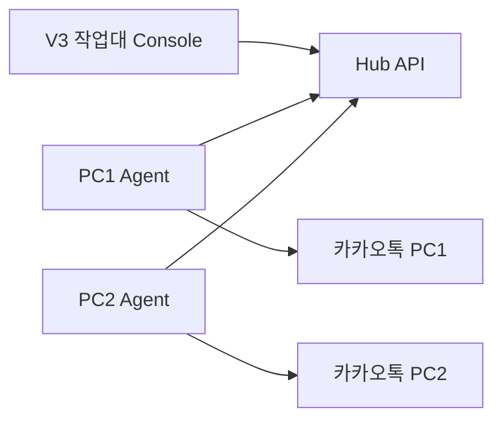

# Phase 2 — V3 멀티 PC 카카오 작업대 구현 계획

**목적:** 수정 기획안에 맞춰 V3를 “관제 대시보드”가 아니라 **작업형 멀티 PC 카카오 작업대**로 설계·구현하기 위한 실행 계획입니다.  
**상태:** 계획 초안  
**선행:** Phase 0 완료 (V1/V2 분리, DRY_RUN, env 정리)  
**관련:** [UI/UX 브리프](phase-2-v3-uiux-brief.md), [요구사항 질문지](phase-2-v3-mvp-requirements.md), [기술 검증 Spike](phase-2-v3-technical-spike.md)

---

## 1. 제품 방향 재정의

### 기존 방향

- 여러 PC 상태를 보는 관제 대시보드
- Agent 상태, heartbeat, 로그, 버전 등 운영 지표 중심
- 원격 제어라는 추상적 개념 중심

### 수정 방향

- 여러 PC의 카카오톡을 한 화면에 모아놓은 **작업대**
- 운영자는 왼쪽에서 PC를 고르고, 중앙에서 톡방을 보고, 하단에서 메시지를 보냄
- “새 톡”, “미등록 톡방”, “개인톡”, “현재 화면”을 놓치지 않는 UI
- 개발자 용어는 내부 구현에만 사용하고 사용자 UI에서는 제거

---

## 2. V3 MVP 제품 범위

### MVP에 포함

| 영역 | 기능 | 설명 |
|------|------|------|
| PC 목록 | PC 상태 표시 | 온라인 / 카카오 꺼짐 / 오프라인 / 오류 |
| PC 목록 | 새 톡 배지 | PC별 새 톡 개수 |
| 톡방 보기 | 등록 톡방 | 등록된 발송 대상 톡방 목록 |
| 톡방 보기 | 미등록 톡방 / 개인톡 | 감지된 신규 톡방, 개인톡 |
| 톡방 보기 | 열기 / 등록 | 톡방 열기, 미등록 톡방 등록 |
| 발송하기 | 메시지 입력 | 텍스트 작성 |
| 발송하기 | 이미지 첨부 | 이미지 파일 선택 |
| 발송하기 | 예약 발송 | 예약 시간 선택 |
| 발송하기 | 보내기 / 발송 중지 | 선택 PC·톡방 대상 작업 |
| 예약 | 톡방별 카운트다운 | 예약이 걸린 방 옆에 남은 시간 표시 |
| 예약 | 메시지 미리보기 | 타이머 클릭 시 어떤 메시지가 갈지 표시 |
| AI | 자동 응답 후보 | 역할/적극성 설정 후 답변 후보 생성 |
| 현재 화면 | 카카오톡 화면 미리보기 | 선택 PC의 카카오톡 캡처 |
| 현재 화면 | 1초 단위 갱신 | 선택 PC 또는 작업 중 PC 캡처를 지속 갱신 |
| 현재 화면 | 발송 후 자동 갱신 | 보내기 후 1초 뒤 캡처하여 답변 확인 흐름 지원 |
| 개인정보 | 개인톡 최소 노출 | 필요 시 내용 보기, 열람 기록 |

### MVP에서 제외

- 완전 원격 데스크톱 제어
- 마우스 클릭/키보드 입력 전달
- Agent 버전, heartbeat, payload 등 개발자 정보 UI 노출
- 차트, 통계, 복잡한 대시보드
- 권한별 상세 접근 제어 (단, 개인정보 정책은 설계에 반영)
- 전체 메시지 검색
- PC 그룹 관리 (5~10대 기준은 단순 목록 우선)

---

## 3. 화면 구조

```text
┌────────────────────────────────────────────────────────────┐
│ 카카오 매니저                         설정  도움말  새로고침 │
├──────────────┬─────────────────────────────────────────────┤
│ PC 목록       │ 강남점-PC1                                  │
│              │ 온라인 · 카카오 실행 중 · 새 톡 3             │
│ 강남점-PC1 3 │                                             │
│ 분당-PC2     │ [톡방 보기] [발송하기] [현재 화면]             │
│ 수원-PC3     │                                             │
│ 송파-PC4     │ 등록된 톡방 / 미등록 톡방 / 개인톡             │
│              │                                             │
├──────────────┴─────────────────────────────────────────────┤
│ [메시지를 입력하세요]                                       │
│ [이미지 첨부] [예약 발송]                 [보내기] [발송 중지] │
└────────────────────────────────────────────────────────────┘
```

### 레이아웃 원칙

1. 좌측 PC 목록은 고정 너비.
2. 중앙은 선택 PC 작업 공간.
3. 하단 입력 영역은 탭이 바뀌어도 유지하거나, 발송하기 탭에서 가장 쉽게 접근.
4. 상태는 상단 한 줄로 충분히 표현.
5. 문제 상황만 눈에 띄게 강조.

---

## 4. 시스템 구성



### 컴포넌트

| 컴포넌트 | 역할 |
----------|------|
| V3 Console | 운영자 UI. PC 선택, 톡방 보기, 메시지 보내기, 현재 화면 확인 |
| Hub | Agent 상태·톡방 목록·명령 큐 저장/중계 |
| Agent | 각 PC에서 카카오톡 상태 감지, 톡방 목록 보고, 캡처, 제한 명령 실행 |
| Kakao PC | 실제 카카오톡 데스크톱 앱 |

---

## 5. Agent가 제공해야 할 데이터

### 5.1 PC 상태

```json
{
  "pc_id": "pc-001",
  "pc_name": "강남점-PC1",
  "online_status": "online",
  "kakao_status": "running",
  "summary_text": "온라인 · 카카오 실행 중 · 새 톡 3",
  "new_message_count": 3,
  "current_task": "idle",
  "last_seen_at": "2026-05-20T11:30:00+09:00"
}
```

### 5.2 톡방 목록

```json
{
  "registered_rooms": [
    {
      "room_id": "room-001",
      "room_name": "고객상담-A",
      "last_sender": "김지현",
      "last_message_preview": "전화드렸는데 부재중이셔서 톡 남겨요~",
      "last_message_at": "오전 10:15",
      "has_new_message": true
    }
  ],
  "unregistered_rooms": [
    {
      "room_name": "홍길동",
      "kind": "personal",
      "last_message_preview": "안녕하세요 문의드립니다...",
      "has_new_message": true
    }
  ]
}
```

### 5.3 현재 화면

- 선택 PC의 카카오톡 창 캡처 이미지
- 마지막 캡처 시각
- 캡처 실패 사유
- 캡처 갱신 모드: `manual | live_1s | after_send`
- 캡처 대상: 현재 선택 PC / 현재 열린 톡방 / 발송 직후 톡방

### 5.4 실시간 캡처 스트림

V3 작업대의 핵심 UX는 **대화창을 직접 열어본 것처럼 이전 대화와 이후 답변을 확인하는 것**입니다.

따라서 “현재 화면”은 수동 새로고침만이 아니라, 작업 중에는 **1초 단위로 계속 갱신되는 미리보기**를 제공합니다.

권장 정책:

| 상황 | 캡처 주기 | 설명 |
|------|-----------|------|
| PC가 선택됨 | 1초 | 현재 화면 탭 또는 톡방 보기에서 선택 PC를 보고 있을 때 |
| 메시지 보내기 직후 | T+1초, 이후 1초 | 보내기 결과와 상대 답변을 빠르게 확인 |
| 다른 PC로 선택 변경 | 즉시 1회 + 1초 주기 | 이전 PC 스트림 중지, 새 PC 스트림 시작 |
| Console 비활성/최소화 | 3~5초 또는 중지 | 리소스 절약 |
| 미선택 PC | 주기 캡처 없음 | 상태 heartbeat만 유지 |

중요 원칙:

- **모든 PC를 항상 1초마다 캡처하지 않는다.** 5~10대 기준에서도 네트워크·CPU·개인정보 부담이 큼.
- 기본은 **선택 PC 1대** 또는 **발송 작업 중 PC**만 1초 캡처.
- Hub에는 모든 이미지를 영구 저장하지 않고 **최신 프레임 중심**으로 유지.
- 필요 시에만 감사/오류 분석용 스냅샷을 별도 저장한다.

전송 포맷 권장:

- Agent 내부 원본: PNG 가능
- Hub/Console 전송: JPEG 또는 WebP quality 70~80 권장
- Console 표시: “마지막 갱신 12:16:03” 문구 표시
- 캡처 실패 시: 마지막 성공 화면 + “갱신 실패” 뱃지

### 5.5 예약 발송 타이머

예약 발송은 단순히 내부 큐에 넣는 것이 아니라, 운영자가 한눈에 볼 수 있어야 합니다.

데이터 예시:

```json
{
  "room_id": "room-001",
  "room_name": "고객상담-A",
  "message_preview": "안녕하세요. 안내드립니다...",
  "send_at": "2026-05-20T14:30:00+09:00",
  "status": "scheduled"
}
```

UI 원칙:

- 톡방 목록 옆에 가장 가까운 예약 타이머 표시
- 여러 방 예약은 `예약 / AI` 탭에서 시간순 표시
- 타이머 클릭 시 보낼 메시지 전체 미리보기
- 실제 발송 전 취소/수정은 Phase 3에서 상세 설계

### 5.6 AI 자동 응답 후보

AI 자동 응답은 처음부터 “자동 발송”이 아니라 **답변 후보 생성**으로 시작합니다.

모드:

| 모드 | 의미 |
|------|------|
| `off` | AI 사용 안 함 |
| `semi` | 명확한 질문은 AI가 자동 후보 생성, 애매하면 사람 확인으로 분류 |
| `on` | 모든 질문에 대해 AI 후보 생성. 단, 확실하지 않으면 사람 확인으로 분류 |

설정:

- 역할: 예) 분양 상담원, CS 담당자, 예약 안내 담당자
- 답변 적극성: 1~5
- 직접 프롬프트: 어떤 말투/길이/순서로 답할지
- 예시 응답: 사용자가 원하는 답변 샘플
- 참고 자료: FAQ, 가격표, 운영시간, 내부 상담 가이드 등
- 금지 표현/주의사항
- 실제 전송 전 사람 확인 여부

MVP 권장:

- AI는 답변 후보만 생성
- 운영자가 확인 후 보내기
- 대화 캡처/텍스트 인식이 불완전하면 사람이 선택한 문맥만 AI에 전달
- 실제 자동 발송은 별도 High 승인 후 진행
- 채팅 내용은 텍스트로 읽을 수 있으면 텍스트를 우선 사용
- 텍스트 추출이 안 되면 현재 캡처 이미지를 Vision 입력으로 사용
- API 키는 `OPENAI_API_KEY`, 모델은 `OPENAI_MODEL` 환경변수 사용
- 기본 모델은 `gpt-5.4-mini`로 두되, API에서 미지원이면 환경변수에서 교체

프롬프트 구성 예시:

```text
역할:
너는 친절한 분양 상담원이다.

답변 방식:
3문장 이내로 답한다. 먼저 공감하고, 다음에 핵심 안내를 하고, 마지막에 추가 상담을 유도한다.

예시 응답:
문의 감사합니다. 해당 조건은 확인 후 안내드릴 수 있습니다. 연락 가능한 시간을 알려주시면 자세히 도와드리겠습니다.

참고 자료:
- 운영시간: 평일 09:00~18:00
- 가격/세금/법률은 확정 답변 금지

금지/주의:
확정되지 않은 가격 약속 금지. 개인정보 요구 금지. 법률/세무 단정 금지.
```

semi 판정 규칙:

```text
명확하고 참고자료로 답할 수 있으면 [AUTO]로 시작한다.
정보가 부족하거나 애매하면 [REVIEW]로 시작하고 사람이 확인해야 할 이유를 쓴다.
```

---

## 6. 명령 범위

### MVP 명령

| 명령 | 사용자 표현 | 설명 | 위험 |
|------|-------------|------|------|
| `OPEN_ROOM` | 열기 | 선택 PC에서 톡방 열기 | Medium |
| `REGISTER_ROOM` | 등록 | 미등록 톡방을 등록 톡방으로 이동 | Low |
| `SEND_MESSAGE` | 보내기 | 선택 톡방에 메시지/이미지 발송 | High |
| `SCHEDULE_MESSAGE` | 예약 발송 | 지정 시간에 보낼 메시지를 예약 | High |
| `STOP_SENDING` | 발송 중지 | 진행 중 발송 중지 | Medium |
| `REFRESH_SCREEN` | 새로고침 | 현재 화면 캡처 갱신 | Low |
| `START_SCREEN_STREAM` | 화면 자동 갱신 시작 | 선택 PC를 1초 단위로 캡처 | Medium |
| `STOP_SCREEN_STREAM` | 화면 자동 갱신 중지 | 선택 해제/비활성화 시 중지 | Low |

### 후순위 명령

- 카카오톡 앞으로 가져오기
- 클릭 기반 조작
- 키보드 입력 전달
- 완전 원격 제어

---

## 7. 개인정보·보안 정책

### UI 기본 원칙

| 데이터 | 정책 |
|--------|------|
| 개인톡 | 기본은 도착 알림, 내용은 클릭 시 노출 |
| 메시지 본문 | 기본 preview만 표시 |
| 열람 기록 | 개인톡 내용 보기 시 기록 권장 |
| PC IP / Agent 정보 | 일반 UI 노출 금지 |

### 사용자 표현

좋은 표현:

- 개인톡 1건 도착
- 내용 보기
- 미등록 톡방
- 톡방 등록

피할 표현:

- payload
- remote command
- heartbeat
- Agent state
- DRY_RUN

---

## 8. 기술 구현 단계

### Step 1 — SPEC 확정

- UI/UX 질문지 답변 반영
- MVP 포함/제외 기능 확정
- 개인정보 노출 정책 확정
- 메시지 보내기 기능을 MVP에 넣을지 최종 결정

### Step 2 — 코드 구조 분리

현재 `main.py`의 Win32 발송 로직을 V3 Agent가 재사용할 수 있도록 최소 단위로 분리합니다.

예상 구조:

```text
app/
├── sender/
│   ├── win32_kakao.py
│   └── worker.py
├── storage/
│   ├── local_store.py
│   └── settings_manager.py
├── agent/
│   ├── scanner.py
│   ├── screenshot.py
│   └── command_handler.py
└── console/
    └── workspace_window.py
```

이 단계는 Large에 가까우므로 별도 승인 후 진행합니다.

### Step 3 — Agent MVP

- PC 이름 등록
- 카카오 실행 여부 감지
- 등록 톡방 / 미등록 톡방 목록 보고
- 새 톡 개수 보고
- 현재 화면 캡처
- 선택 PC 기준 1초 단위 화면 갱신
- 보내기 후 1초 뒤 자동 캡처
- Hub로 주기 보고

### Step 4 — Hub MVP

- Agent 등록
- 상태 저장
- 톡방 목록 저장
- 현재 화면 이미지 최신 프레임 저장 또는 임시 제공
- 캡처 이미지 영구 저장은 기본 비활성
- 명령 큐

### Step 5 — Console MVP

- 좌측 PC 목록
- 중앙 톡방 보기 / 발송하기 / 현재 화면 탭
- 하단 메시지 입력
- 새 톡 배지
- 미등록 톡방 등록 팝업

### Step 6 — 제한 명령

- 열기
- 등록
- 보내기
- 발송 중지
- 현재 화면 새로고침

### Step 7 — 파일럿

- 2대 PC로 시작
- 이후 5대 → 10대
- 오발송·개인정보 노출·캡처 실패 로그 점검

---

## 9. 주요 리스크

| 리스크 | 설명 | 대응 |
--------|------|------|
| 카카오 UI 감지 한계 | PC 카카오톡 내부 메시지/새 톡 감지가 Win32로 제한될 수 있음 | MVP 전 기술 검증 필요 |
| 현재 화면 캡처 보안 | 개인톡 내용이 캡처에 포함될 수 있음 | 기본 최소 표시, 열람 기록 |
| 원격 보내기 오발송 | 잘못된 PC/톡방으로 발송 가능 | 확인 모달, 권한, 로그 |
| Agent 안정성 | 여러 PC에서 장시간 실행 | heartbeat, 재시작, 오류 표시 |
| `main.py` 단일 파일 | 재사용 어려움 | 단계적 모듈 분리 |

---

## 10. 기술 검증이 먼저 필요한 항목

1. Agent가 카카오톡에서 **새 톡 개수**를 안정적으로 감지할 수 있는가?
2. Agent가 **미등록 톡방/개인톡**을 구분할 수 있는가?
3. 현재 화면 캡처가 권한 문제 없이 가능한가?
4. 원격 `OPEN_ROOM` 명령이 기존 Win32 방식으로 안정적으로 동작하는가?
5. 메시지 preview를 어디까지 자동 수집할 수 있는가?

위 항목은 UI 확정 전 **Prototype Spike**로 검증해야 합니다.

---

## 11. 다음 실행 계획

### 11.1 바로 할 일

1. UI/UX 디자이너에게 [브리프](phase-2-v3-uiux-brief.md) 전달
2. PM이 [요구사항 질문지](phase-2-v3-mvp-requirements.md)의 핵심 항목 답변
3. [기술 검증 Spike](phase-2-v3-technical-spike.md)에 따라 읽기/캡처 중심 Prototype 작성

### 11.2 Cursor 작업 단위 제안

| 순서 | 작업 | 규모 | 위험 |
|------|------|------|------|
| A | V3 확정 SPEC 작성 | Small | Low |
| B | 카카오톡 새 톡/톡방 감지 Spike SPEC | Small | Medium |
| C | `main.py` 발송 로직 모듈 분리 SPEC | Medium | Medium |
| D | Agent 화면 캡처 Prototype | Medium | Medium |
| E | Hub/Console MVP SPEC | Large | Medium |
| F | 예약 타이머 / AI 답변 후보 확정 SPEC | Medium | Medium~High |

---

## 12. 결정 필요 사항

- MVP에 `보내기`를 실제 발송까지 포함할지, 먼저 화면/톡방/등록 중심으로 갈지
- 미등록 톡방 감지의 기술 한계를 어디까지 허용할지
- 개인톡 내용 노출 기본값
- Console 구현을 PyQt6로 할지 PySide6로 할지
- Hub DB를 기존 ERP와 분리할지
- 1차 파일럿 PC 대수

